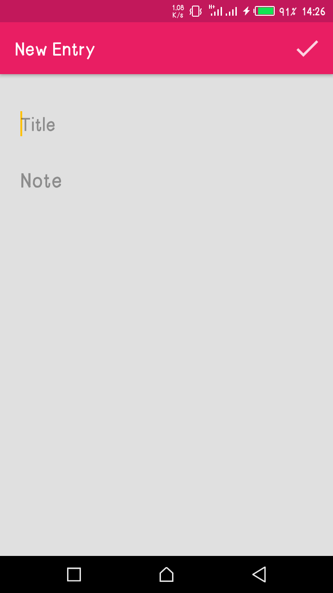

# JournalApp
A Journal Application where users can pen down their thoughts and feelings

## Prerequisites 
* Java 7 or 8
* Android Studio 3.1.3
* Gradle 4.1
* Min SDK Android Lollipop 5.0 

## Installation
* Start up your terminal (or Command Prompt on Windows OS).
* Clone this respository by entering command git clone https://github.com/iyamu-j/JournalApp in the terminal
* Navigate to the project folder using cd AgricEngrDict on your terminal (or command prompt) (If the required specifications are present, please ignore this step)
* To download Android Studio, click the download button here (https://developer.android.com/studio)

## Screenshots 

## Author
**Iyamu Ayevbeosa Joshua**
